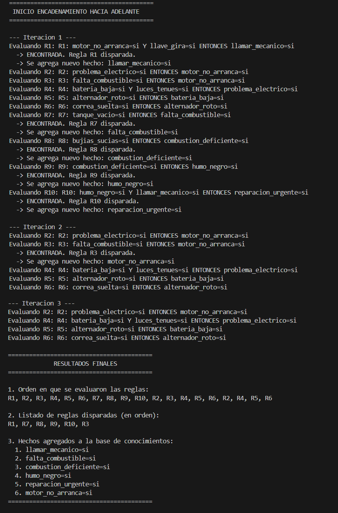
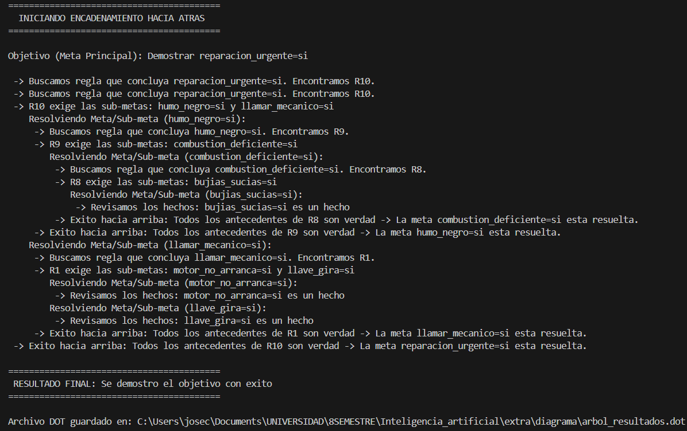
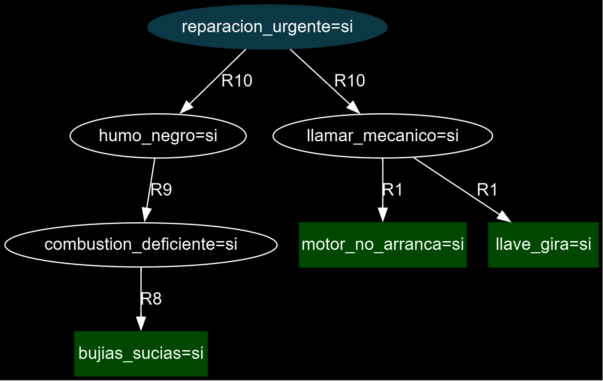

# Motor de Inferencia: Sistemas Basados en Reglas

Este proyecto implementa un Motor de Inferencia lógico desarrollado en **Java**, capaz de procesar una base de conocimientos y deducir nueva información utilizando dos de los principales algoritmos de los Sistemas Expertos: **Encadenamiento hacia Adelante** (Forward Chaining) y **Encadenamiento hacia Atrás** (Backward Chaining).

## Arquitectura del Sistema

El proyecto está diseñado bajo principios de Programación Orientada a Objetos (POO), priorizando una estructura modular y evitando el uso de estructuras Hash para cumplir estrictamente con restricciones de diseño algorítmico (utilizando listas dinámicas y búsquedas lineales).

* **Modelos:** Se definieron las clases `Regla`, `Condicion` (Antecedentes) y `Hecho` (Consecuentes/Afirmaciones), encapsulando la lógica matemática y relacional.
* **Lector / Parser:** El sistema cuenta con una utilidad nativa para ingerir bases de conocimiento desde archivos de texto plano (`.txt`), interpretando dinámicamente operadores relacionales (`>`, `<`, `=`, `>=`).
* **Open World Assumption:** El motor está programado bajo la premisa lógica de que la ausencia de un hecho en la memoria de trabajo no implica su negación, requiriendo información explícita para el disparo de reglas lógicas.

---

## 1. Encadenamiento hacia Adelante (Forward Chaining)

El motor utiliza un enfoque impulsado por los datos (*Data-Driven*). Partiendo de un conjunto de hechos iniciales, el sistema itera por saturación sobre la base de reglas lógicas. 

El algoritmo evalúa las condiciones de cada regla y, si se cumplen, dispara el consecuente agregándolo a la Memoria de Trabajo. Este ciclo se repite hasta que la variable de control determina que no es posible deducir ninguna nueva conclusión, garantizando la extracción total del conocimiento.

### Resultados de Ejecución
A continuación, se muestra el comportamiento del motor, detallando el orden de evaluación, las reglas que cumplieron sus requisitos lógicos (disparadas) y los nuevos hechos inferidos:


---

## 2. Encadenamiento hacia Atrás (Backward Chaining)

Para la demostración de hipótesis, se implementó un algoritmo impulsado por objetivos (*Goal-Driven*). El sistema recibe una "Meta" y utiliza **recursividad profunda (Pila/Stack)** para buscar reglas que la concluyan.

Si los antecedentes de una regla no están en la base de hechos, el motor los convierte en nuevas "Sub-metas" y se llama a sí mismo para demostrarlas. El sistema implementa:
* **Backtracking:** Capacidad de dar marcha atrás y descartar ramas de evaluación si un camino deductivo fracasa, buscando rutas alternativas.
* **Prevención de Ciclos Infinitos:** Utilización de un registro de nodos visitados en la rama actual para evitar desbordamientos de pila (Stack Overflow) en bases de reglas cíclicas.

### Trazabilidad del Algoritmo
La siguiente ejecución demuestra el recorrido en profundidad del motor intentando probar el objetivo principal, mostrando el desglose de sub-metas y el éxito/fracaso de cada evaluación:



---

## 3. Generación Gráfica del Árbol de Deducción

Como valor agregado y herramienta de comprobación visual, el sistema cuenta con integración nativa y multiplataforma con **GraphViz**. 

Tras una ejecución exitosa del Encadenamiento hacia Atrás, el motor mapea la ruta deductiva exitosa (ignorando los caminos descartados por el backtracking) y genera automáticamente un archivo de dependencias `.dot`. Inmediatamente después, invoca subprocesos del sistema operativo (`ProcessBuilder`) para renderizar y exportar el Árbol de Inferencia final.

### Árbol de Inferencia Resultante
* **Nodo Azul:** Objetivo / Meta principal demostrada.
* **Nodos Verdes:** Hechos iniciales (Premisas).
* **Aristas:** Reglas lógicas que conectan los hechos.



---

## Estructura de la Base de Conocimientos (Uso)

Para ejecutar el programa, los archivos de texto deben encontrarse en la carpeta designada con la siguiente sintaxis estricta:

**Formato `hechos.txt`:**
```text
correa_suelta=si
luces_tenues=si
llave_gira=si
```

**Formato `reglas.txt`:**
```text
R1: motor_no_arranca=si Y llave_gira=si ENTONCES llamar_mecanico=si
R4: bateria_baja=si Y luces_tenues=si ENTONCES problema_electrico=si
R8: bujias_sucias=si ENTONCES combustion_deficiente=si
```